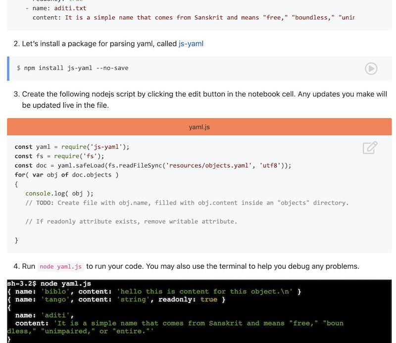

## Preliminary Course Setup

```bash
 ____  ____  _  _   __  ____  ____ 
(    \(  __)/ )( \ /  \(  _ \/ ___)
 ) D ( ) _) \ \/ /(  O )) __/\___ \
(____/(____) \__/  \__/(__)  (____/

The Ottomatica Distribution ttyS0

v2021.1 - Kernel 5.10.1

ncsu-csc login: ░
```

### Communication channels

1. We will use [Discord](https://discord.com/), a platform supporting instant messaging, group discussion in channels, and even voice, and video broadcasts, for course communication, clarification questions, class activities, and announcements. You can get the Desktop and mobile app or use the web version.  

    You can join the server using this signup link:
    (_Provided in email._)

### Development Tools

We will be use using node.js through the course.

2. Follow the instructions to install [nodejs](https://nodejs.org/en/). 

_If running nodejs on Windows, you may want to check the option to install devtools, which will improve your ability to build c/c++ based modules on windows_.

### Docable Notebooks

We will use notebooks for some learning exercises.

3. Please follow [install instructions](https://github.com/ottomatica/docable-notebooks/blob/master/docs/install.md) to install [docable notebooks](https://github.com/ottomatica/docable-notebooks).




### Opunit checks

Do you have a functioning development environment needed for the course? 

We have a tool that can help check.

4. Inside a [terminal](https://github.com/chrisparnin/EngineeringBasics/blob/master/Shells.md#shells), run:

```bash
npm install ottomatica/opunit -g
```

5. Now run:

```bash
opunit profile CSC-DevOps/profile:519.yml
```

You should see something like:


For more details about this report, [see this page](https://github.com/CSC-DevOps/profile). You will want to have as many green checks as possible before starting class.


