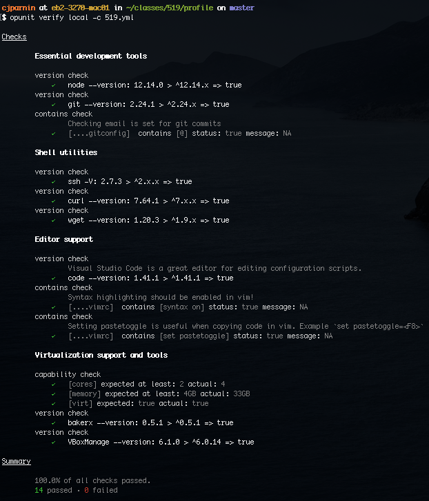

### Communication channels

1. We will use Stack Overflow Teams (a private space for the class) to ask and answer technical questions about the course assignments and topics. 

    Sign up! https://stackoverflow.com/c/ncsu/join

2.  We will use mattermost, an open-source slack alternative, for course communication, clarification questions, in-class discussion, and announcements. You can get the Desktop and mobile app.  

    You can join the team using this signup link:
    (_Provided in email._)

### Preliminary Course Setup

Do you have a functioning development environment needed for the course? We have a tool that can help check.

➡️ Follow the instructions to install [nodejs](https://nodejs.org/en/). 

_If running nodejs on Windows, you may want to check the option to install devtools, which will improve your ability to build c/c++ based software on windows_.

Inside a [terminal](https://github.com/chrisparnin/EngineeringBasics/blob/master/Shells.md#shells), run:

```bash
npm install opunit -g
```

Now run:

```bash
opunit profile CSC-DevOps/profile:519.yml
```

You should see something like:



For more details about this report, [see this page](https://github.com/CSC-DevOps/profile). You will want to have as many green checks as possible before starting class.

### Basics

Do you need a refresher on git, shells, virtual machines? 

➡️ Try this workshop:
https://github.com/chrisparnin/EngineeringBasics

The primary goal of this workshop is for you have to have installed and learned a set of relevant tools (and processes in your head) for software development.

1. Setup  
   Getting started. Get some tools on your machine. 
   - [ ] Practice: Installed package manager for os.
   - [ ] Installed git, java, python2, nodejs
   - [ ] Optional: Make Windows Awesome
2. Shells  
   Basic overview of unix shells, shell programming, and windows shell tips.
   - [ ] Practice: Run commands to analyze data
   - [ ] Setup env variable.
   - [ ] Optional: Write a shell script.
3. Git  
   Basic overview of git. Two interactive tutorials for learning commands.
   - [ ] Complete basic Git tutorial
   - [ ] Complete 4 levels in *Introduction to Git Commits*
   - [ ] Practice: Creating a repo
   - [ ] Optional: Solve all git branching levels
4. Markdown + Editors  
   Overview of markdown basics, lists, code, tables. Recommended editors for code. Creating Github Pages.
   - [ ] Install IDE(s)/Editors
   - [ ] Practice: Update markdown in README.md
   - [ ] Practice: Familizarize yourself with some of Eclipse's advanced features and then use them to [fix a few bugs](https://github.ncsu.edu/kpresle-tools/EclipseTutorial).
   - [ ] Optional: Create a GitHub Pages (gh-pages branch) 
5. Environments  
   Tools for creating and managing virtual computing environments.
   - [ ] Install VirtualBox and Baker
   - [ ] Create a simple virtual machine
   - [ ] Optional: Create your own environment
6. Online Tools  
   Using Github issues and Trello boards for task management.
   - [ ] Create issue on GitHub with this checklist (filled in) 
   - [ ] Try trello

### Advanced

Try a [docker dungeon](https://github.com/CSC-DevOps/DockerDungeons/tree/master/NodeJsSever#docker-dungeon--nodejs).


