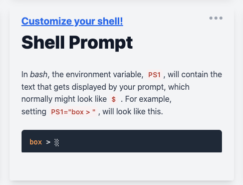

[Setup](Setup.md#setup) | [Shells](Shells.md#shells) |  [Git](Git.md#git) | [Markdown and IDEs](MarkdownEditors.md#markdown) |  [Virtual Environments](Environments.md#environments) | [Task Management](OnlineTools.md#online-tools)

# Setup

To successfully build software, you need a properly configured environment with a variety of tools. To help us get started, we will we install some tools, package managers, that make it a little easier to configure systems. 

Whether you're a Mac, Windows, or Linux user---you should be able to find a way to be productive with the tools from this workshop. However, there may be specific tweaks, issues, and accomodatations you may have to make based on your platform.

### 1. Finding your terminal.

* **Mac**: you can run the Terminal in Applications and pin to your Dock.

* **Windows**: You access a shell in several ways. You can right click on the Windows Icon in the Task Bar and open a terminal window. You can also type in the name of the shell program in the search bar (e.g., Cmd/Powershell). 

*Tip*: IDES, such as VS Code provide easy access to a terminal (View ⇨ Terminal).

**Deciding on a Terminal/Shell for Windows?**

📒 See more: [Understanding your terminal in Windows](https://devops.docable.cloud/chrisparnin/v/61dcea308f429d8b25b56bf4).


### 📒 Online Exercise: Customize your prompt


Click the following to start the exercise.

<a href="https://devops.docable.cloud/chrisparnin/v/61c127300cd38e085f371fc2">

</a>

### 2. Privileged commands

Some commands require adminstrative or super user privileges.

* **Mac/Linux**: To access a privileged shell, you simply can run `su` or prepend a command with `sudo`. `sudo` will cache your password, typically for 5 minutes, after successfully running a command. To avoid typing a password at all, you may add your user to `/etc/sudoers`---note it is recommended you make changes to this file using the special utility: [visudo](https://www.digitalocean.com/community/tutorials/how-to-edit-the-sudoers-file).

* **Windows**. If you need to run a command with admin, you must start a shell with admin privilege. There is typically an admin command shell available in the menu when right clicking the Windows Icon on the Task Bar. You can also get one from right clicking the Cmd executable in the search bar.

   *Tip*: If opening up a cmd shell in admin mode, make sure you do not perform operations, such as `git clone` in your current directory (`C:\WINDOWS\system32`). Otherwise, you will be writing to a location that only admin will have access to which will make it difficult to run the commands/tasks you are intending on doing.

##### Checking your System's Execution Policy (Windows)

We are going to check your execution policy for your machine, which determines what scripts or software are allowed to run.

We are going to run the following command in the `powershell` shell, and check that your policy is not `Restricted` for your user.

```bash|{type: 'command', platform:'win32', shell: 'powershell', failed_when: "stdout.includes('Restricted')||exitCode==1"}
Get-ExecutionPolicy -List
```

If you are going to be running future commands or scripts, you definately want to fix this. Here are some options:

* `AllSigned`. Requires that all scripts and configuration files are signed by a trusted publisher, including scripts written on the local computer.
* `RemoteSigned`. Requires that all scripts and configuration files downloaded from the Internet are signed by a trusted publisher. The default execution policy for Windows server computers.
* `ByPass`. Nothing is blocked and there are no warnings or prompts. You can use this to _temporarily_ skip security checks: `Set-ExecutionPolicy Bypass -Scope Process`.

We recommend running one of the following: 

```bash|{type: 'command', platform:'win32', shell: 'powershell', privileged: true}
Set-ExecutionPolicy AllSigned -Scope CurrentUser
```

```bash|{type: 'command', platform:'win32', shell: 'powershell', privileged: true}
Set-ExecutionPolicy RemoteSigned -Scope CurrentUser
```

### 4. Package Managers.

**An installation philosophy**
> *Avoid manual installation, automate with package managers!*

When possible, using a package manager can allow you to automate and streamline the installation of tools. Instead of hunting down the right website, finding the right version and dowload link, then clicking through an installation wizard---you let the package manager take care of all those manual steps for you! 

*Tip*: Later on, the ability to automate the installation of software environments becomes important in later stages of software development, such as continuous integration, or deployment.

We will learn how to use package managers to help use manage our system.

*Package managers* are tools for installing libraries and tools, which help manage dependencies and configuration of files and environment variables. 

There are generally two flavors of package managers. 

* *Binary* package managers typically install platform specific dependencies: (`brew`, `choco`, `apt-get`) 
* *Source* package managers typically install libraries you can use in your code: (`npm`, `pip`, `maven`)

## Install a Package Manager on Your System

If you're using Linux, you typically already have a package manager, such as `yum` or `apt-get`. You can skip this section.

#### Installing HomeBrew on Mac OS X

Homebrew is a popular package manager for MacOS. 

Let's check if we have `brew` installed on the system. If not, use the [Homebrew Install Instructions](install-brew.md).
```bash|{type: 'command', platform:'darwin'}
brew --version
```


Here is an example of how to install the utility `wget`.
```bash|{type: 'command', platform:'darwin'}
brew install wget
```

#### Installing Chocolatey on Windows

Chocolatey is a package manager for Windows. Once Chocolatey is installed, you can use it to install other tools on your system using `choco install <package-name>`.

We will check if we have choco installed. If not, use the [Chocolatey Install Instructions](install-choco.md).

```bash|{type: 'command', platform:'win32', failed_when:"!stdout.includes('Chocolatey v')"}
choco --V
```


Important, when running commands that will make changes to your system, you may need to "Run (them) as Administrator". Notice, how when we run this command, `choco` warns us that we are not running inside an elevated shell.

```bash|{type: 'command',platform:'win32', stream: true}
choco install wget -y
```

We can try again, but this time, with a shell that has administrative priliveges:

```bash|{type: 'command', privileged: true, platform:'win32', stream: true}
choco install wget -y
```

Finally, we can remove `wget` using the `remove` parameter.

```bash|{type: 'command', privileged: true, platform:'win32'}
choco uninstall wget -y --remove-dependencies
```

## Practice: Installing useful software

See if you can find the packages for these tools with your package manager and install them (if you do not already have them).

* `wget`, a tool for performing web requests.
* `nc`, a general networking tool (package name might be `netcat`).
* `jq`, a tool for querying and manipulating and JSON files.
* `git`, a tool for man

We'll help you open up the appropriate shell you will need for you system.

Windows (Admin)

```bash|{type: 'command', platform:'win32', privileged: true}
start
```

Mac/Linux:

```bash|{type: 'command', platform:'darwin'}
open -a "Terminal" .
```

After you've installed the appropriate commands, let's check if we have installed these programs on the system...

```bash|{type: 'command'}
git --version
```

```bash|{type: 'command'}
jq --version
```

```bash|{type: 'command'}
wget -V
```

### 📒 Online Exercise: Install the packages!

Click the following to start the exercise.

<a href="https://devops.docable.cloud/chrisparnin/v/61b3ed6a7db4f2fc6edefd59">

</a>


### 5. Path and Environment Variables.
Environment variables are dynamically configurable elements that are available to processes on your system.

Mac/Linux: `echo $PATH`
Windows: `echo %PATH%`

A common problem with shells is that changing your `PATH` or other environment variables after an installation/OS GUI change will not affect any currently open shells. You either have to manually refresh the shell or open a new one. 

##### Setting Environment Variables (Windows)

In addition to editing environment variables in your desktop manager GUI, you can also set environment variables in your shell.

In Windows, you can use `set` and `setx` to update environment variables. `set` will update environment variables in your current shell instance, but that will be lost after the shell closes. Using `setx`, you can permanently, set an environment variable for the user or system (use `setx /m`). See the [documentation](https://docs.microsoft.com/en-us/windows-server/administration/windows-commands/setx) for more information.

```bash|{type:'command'}
set DEBUG_MODE=true
echo "Current DEBUG_MODE=%DEBUG_MODE%"
```

Tip: One limitation of using setx is that it cannot store values longer than 1024 characters.

##### Setting Environment Variables (Mac/Linux)

In bash/*sh environments, you can set temporary environment variables in two ways:

Like `set`, you can define a variable just for your shell session, but not for running programs.

```bash|{type:'command'}
DEBUG_MODE=true
echo $DEBUG_MODE
node -e 'console.log(`DEBUG_MODE=${process.env.DEBUG_MODE}`);'
```

##### Scoping

You can also define a variable that will only exist inside a subprocess spawned from the shell. **This may not behave the way you expect**!

```bash|{type:'command', shell:"bash"}
DEBUG_MODE=true echo "DEBUG_MODE=$DEBUG_MODE"
DEBUG_MODE=true node -e 'console.log(`DEBUG_MODE=${process.env.DEBUG_MODE}`);'
```
A blank is printed out because `$DEBUG_MODE` is expanded before the process executing the echo command is started. On the other hand, inside the node program, the process inherits the shell's environment variables, including the DEBUG_MODE variable.

Finally, you can enable access to an environment variable for all processes and subprocesses started in the shell by using `export VAR=VALUE`

```bash|{type:'command'}
export DEBUG_MODE=true
echo $DEBUG_MODE
node -e 'console.log(`DEBUG_MODE=${process.env.DEBUG_MODE}`);'
```

> *Permenant environment variables are actually more tricky in Mac/Linux shells!*

When a shell is initialized, several startup scripts are run for customization and initialization. If you want to make a variable always available, a common strategy is to locate one of these initialization scripts (typically in your home directory, and editing them to run your commands on startup). Common locations include: `~/.profile`, or `~/.bashrc`. The symbol `~`, is a shortcut for your home directory: `/home/<user>`.

To summarize (Mac/Linux):

* Use `export VAR=VALUE` to enable a variable to be seen by all executed commands.
* Use `VAR=VALUE` for a variable only available in the shell.
* Use `VAR=VALUE <command>` for a variable only available to that command.
* Set permenant variables inside a start script such as `~/.bashrc`.


