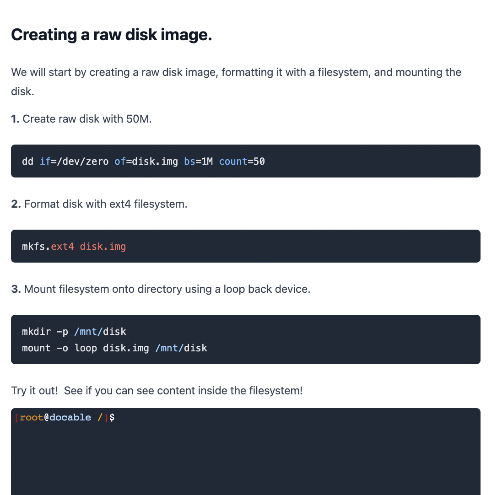

# Virtual Machine Images

In this workshop, we'll cover a few core concepts related to virtual machine images, including their storage formats and the operations needed to boot them. We will cover how they are built from scratch and practice a few of the steps.

## Understanding Virtual Machine Images

A _virtual machine image_ is a file, containing contents and structure for an operating system, suitable for running in a virtualization platform or OS hypervisor. The file may simply be a _disk image_ (sectors, volumes, partitions) or contain additional information about the virtual machine configuration (networking, memory, etc).

### Common formats

| Format | Description | Commonly used in |
| ---- | ------- | ------ |
| Disks images
| RAW  | Disk image with fast performance, limited features | Many linux distributions
| VHD  | Raw disk with header. | Hyper-V, Azure.
| VHDX | Supports resizing, large disks. |Hyper-V, Azure.
| VMDK | Supports resizing, large disks. | VMWare/Oracle products. 
| qcow2| Uses copy-on-write, useful for snapshots | QEMU/KVM
| ISO | A disk image packaged as ISO 9660/CD-ROM | Installers, live distributions
| Machine images
| OVA/OVF | Contains virtual machine information in addition to disks | Used in VMware and several cloud providers.
| BOX | A tar file containing, OVF | Used by vagrant 
| AMI | Amazon machine image | AWS

### Sparse files

Imagine you downloaded an [Ubuntu Focal image](https://cloud-images.ubuntu.com/focal/current/focal-server-cloudimg-arm64.tar.gz), containing a disk image. You notice that it is `1.3G` in size.

```bash
ls -lh ~/focal-server-cloudimg-arm64.img 
-rw-r--r--@ 1 cjparnin  staff   1.3G Dec 16 17:55 ~/focal-server-cloudimg-arm64.img
```

Unfortunately, when you boot the virtual machine, you're already running out of space and can't even successfully boot:  
`No space left on device`

```bash
[FAILED] Failed to start Network Name Resolution.
See 'systemctl status systemd-resolved.service' for details.
[  OK  ] Stopped Network Name Resolution.
[FAILED] Failed to start Network Name Resolution.
See 'systemctl status systemd-resolved.service' for details.
         Starting Initial cloud-ini… (metadata service crawler)...
[    5.050102] cloud-init[512]: OSError: [Errno 28] No space left on device
```

🧰 What can we do? The fix is surprisingly simple, use a sparse file! 

> A _sparse file_ is a specialized file that contains mostly empty-data. Sparse files allow for storage efficient disk images, and is one method for resizing a disk image.

Create a sparse file using `dd`. The existing disk image will be extended to be 10G in size.

```bash
$ dd if=/dev/zero of=rootfs seek=10240 obs=1m count=0
...
$ ls -lhs ~/.basicvm/VMs/v1/rootfs 
3416152 -rw-r--r--  1 cjparnin  staff    10G Feb  6 09:22 ~/.basicvm/VMs/v1/rootfs
```

After booting and installing packages, the actual size on disk is still just `3416152 blocks * 512 bytes = ~1.75G`.

> ⚠️ Coping a sparse file may result in using the fully allocated space. So your 1.7G file might actually be 10G when you copy it! Also note, some programs do not work well with sparse files, and overtime, a sparse file may become fragmented.

If copying a sparse file, make sure you use provide sparse option for the command:

```bash
$ cp --sparse=always source_file new_file
$ rsync --sparse source_file new_file
$ dd if=srcFile of=dstFile iflag=direct oflag=direct bs=64K conv=sparse
```

## Booting a Virtual Machine Image

In most cases, we want a virtual machine image so that we can run the operating system stored inside. How exactly does this happen?

The key ingredients involve a bootloader and a kernel.

A _bootloader_ is a program that runs on the computer's firmware (low-level software etched onto hardware) in order to initially load an operating system into memory. A _kernel_ is the core of an operating system, which managements devices, services, and user programs.

You typically will see two common types of firmware:

|     |     |
| --- | --- |
| BIOS     | Legacy firmware | |
| EFI/UEFI | Standard for firmware, making easier to write bootloaders. |

Some bootloaders include:

* `BOOTMGR`, Microsoft Windows bootloader.
* `GRUB2`, Bootloader with many features, such as mutli-boot menus.
* `syslinux`, a simple bootloader, often used with bootable ISO disks.


### Bootable disk images

Some virtualization platforms, such as VirtualBox or Hyper-V, require that disk images contain bootloaders in order to run.

To create a bootable disk image, the disk is split into partitions, with some partitions containing the bootloader and kernel, and the other partitions containing the remaining content (libraries, binaries, configuration, etc)

```bash
echo "Creating disk sized $1M"
dd if=/dev/zero of=rootfs.ext4 bs=1M count=$1

# Create two partitions (ESP for boot and second for rootfs).
sgdisk --clear \
  --new 1::+100M --typecode=1:ef00 --change-name=1:'EFI System' \
  --new 2::-0 --typecode=2:8300 --change-name=2:'slim-rootfs' \
  --attributes 1:set:2 \
  rootfs.ext4
```

After setup, the result will look something like this.

```bash
--------------------
|  GPT Header      |
|  GPT entries     |
--------------------
| EFI partition    |  => /EFI/BOOT/BOOTX64.EFI (bootloader)
|                  |  => /EFI/BOOT/VMLINUZ (kernel)
--------------------
| LINUX partition  |
|                  |  => /bin
|                  |     /lib
... 
```

An example configuration for the GRUB2 bootloader, including the location of the kernel, kernel cmdline parameters. A command for building the bootloader follows.

```bash
# GRUB 
cat >> $ESP/EFI/BOOT/grub.cfg <<EOF
set timeout=0
set gfxpayload=text
menuentry 'Slim' {
	linuxefi /EFI/BOOT/vmlinuz root=/dev/sda2 console=tty0 console=ttyS0,115200n8 earlyprintk=ttyS0,115200 rootdelay=300 text
  initrdefi /EFI/BOOT/initrd
}
EOF

GRUB_MODULES="part_gpt part_msdos efi_uga gptsync fat ext2 lvm iso9660 lsefi gzio linux linuxefi acpi normal cpio crypto disk boot crc64 \
search_fs_uuid tftp xzio lzopio xfs video scsi multiboot hfsplus udf"

grub-mkimage -d /usr/lib/grub/x86_64-efi -O x86_64-efi -o BOOTX64.EFI -p /EFI/BOOT ${GRUB_MODULES} linuxefi;
cp BOOTX64.EFI $ESP/EFI/BOOT/BOOTX64.EFI
```


### The kernel initialization process

start_kernel()
=> arch_call_rest_init
  => arch_call_rest_init
    => kernel_init (as thread)


Kernel booting, unpacking initramfs, and initializing devices, kernel modules, and networking.

```
start_kernel(void)
{
	char *command_line;
	char *after_dashes;

    set_task_stack_end_magic(&init_task);
    smp_setup_processor_id();

[    0.000000] Booting Linux on physical CPU 0x0000000000 [0x00000000]
[    0.000000] Linux version 5.4.0-97-generic (buildd@bos02-arm64-018) (gcc version 9.3.0 (Ubuntu 9.3.0-17ubuntu1~20.04)) #110-Ubuntu S
MP Thu Jan 13 18:28:08 UTC 2022 (Ubuntu 5.4.0-97.110-generic 5.4.162)
```

```
...	boot_cpu_init();
	page_address_init();
	pr_notice("%s", linux_banner);
	early_security_init();
	setup_arch(&command_line);
	setup_boot_config();
	setup_command_line(command_line);
	setup_nr_cpu_ids();
	setup_per_cpu_areas();
	smp_prepare_boot_cpu();	/* arch-specific boot-cpu hooks */
	boot_cpu_hotplug_init();

	pr_notice("Kernel command line: %s\n", saved_command_line);
	/* parameters may set static keys */
	jump_label_init();
	parse_early_param();
	after_dashes = parse_args("Booting kernel",
				  static_command_line, __start___param,
				  __stop___param - __start___param,
				  -1, -1, NULL, &unknown_bootoption);
	print_unknown_bootoptions();
```


```
[    0.000000] Booting Linux on physical CPU 0x0000000000 [0x00000000]
[    0.000000] Linux version 5.4.0-97-generic (buildd@bos02-arm64-018) (gcc version 9.3.0 (Ubuntu 9.3.0-17ubuntu1~20.04)) #110-Ubuntu S
MP Thu Jan 13 18:28:08 UTC 2022 (Ubuntu 5.4.0-97.110-generic 5.4.162)
[    0.000000] efi: Getting EFI parameters from FDT:
[    0.000000] efi: UEFI not found.
```

```
dev_symlink("/proc/self/fd", "fd");
[    0.059653] devtmpfs: initialized
```

```
[    0.222929] cacheinfo: Unable to detect cache hierarchy for CPU 0
[    0.319762] loop: module loaded
[    0.320170] libphy: Fixed MDIO Bus: probed
[    0.320241] tun: Universal TUN/TAP device driver, 1.6
[    0.320408] PPP generic driver version 2.4.2
[    0.320526] ehci_hcd: USB 2.0 'Enhanced' Host Controller (EHCI) Driver
[    0.320676] ehci-pci: EHCI PCI platform driver
[    0.320822] ehci-orion: EHCI orion driver
[    0.320898] ohci_hcd: USB 1.1 'Open' Host Controller (OHCI) Driver
[    0.320987] ohci-pci: OHCI PCI platform driver
[    0.321069] uhci_hcd: USB Universal Host Controller Interface driver
[    0.321213] mousedev: PS/2 mouse device common for all mice
[    0.321356] i2c /dev entries driver
[    0.321586] device-mapper: uevent: version 1.0.3
[    0.321717] device-mapper: ioctl: 4.41.0-ioctl (2019-09-16) initialised: dm-devel@redhat.com
[    0.321902] ledtrig-cpu: registered to indicate activity on CPUs
[    0.322181] drop_monitor: Initializing network drop monitor service
[    0.322439] NET: Registered protocol family 10
[    0.328465] Segment Routing with IPv6
[    0.328556] NET: Registered protocol family 17
[    0.328677] Key type dns_resolver registered
[    0.328852] registered taskstats version 1
....
```

Moun

```
[    0.350045] hctosys: unable to open rtc device (rtc0)
[    0.351563] Freeing unused kernel memory: 6912K
[    0.361641] Checked W+X mappings: passed, no W+X pages found
[    0.361728] Run /init as init process
Loading, please wait...
Starting version 245.4-4ubuntu3.15
```

The `/init` process and hand-off.  Process zero.

## Building images

### Making initramfs

Building initramfs

```
find . | cpio -o -H newc 2>/dev/null | gzip > ../initrd
```

### 📒 Online Exercise: Creating a rootfs

↳ Click the following to start the exercise.

<a href="https://devops.docable.cloud/chrisparnin/v/61fa97d5b405b677b416a7c5">

</a>

### Packaging as iso

...

## References

http://www.aclevername.com/articles/linux-xilinx-tutorial/minimalist-initramfs.html

https://cloud-images.ubuntu.com/focal/current/

https://tldp.org/LDP/lfs/LFS-BOOK-6.1.1-HTML/chapter06/devices.html

https://kicherer.org/joomla/index.php/en/blog/47-the-essential-steps-in-the-linux-kernel-to-mount-and-boot-an-initramfs-and-root-filesystem


http://henryomd.blogspot.com/2014/11/linux-kernel-startup.html