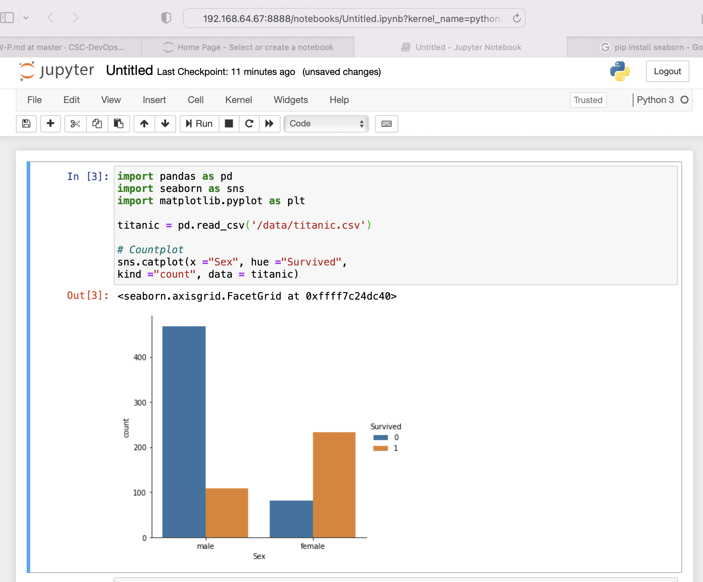

# Packaging and Provisioning

The assignment is due Friday, Feb 18th, before midnight.

## Building a Virtual Machine Image (70) 💿



### Setup

1. Find a suitable option for [running docker on your system](../Content/Virtualization/Containers/DockerOptions.md).


2. Clone the following template repository. Then, modify the git remote url so that it now will point to your HW2-<unity> repo.

```bash
git clone http://github.com/CSC-DevOps/P
cd P
git remote -v
git remote set-url origin https://github.ncsu.edu/CSC-DevOps-S22/HW2-<unity>-DevOps
```

3. Install node packages and test.

```bash
npm i
npm link
# Build your custom docker image
p init
# Build rootfs, extract kernel, initrd and package as iso.
p build
```

### Base Requirements

Extend the program to perform the following tasks.

1. Build Docker image.

Build a docker image that will contain all the tools needed for performing your image build. For example, you will want to install `mkisofs` for creating an ISO, and `e2fsprogs` for formating a filesystem of a raw image.

Extend the `images/Dockerfile` to complete this step.

2. Create a rootfs.

Extend the `scripts/make-rootfs.sh` script that executes inside your custom docker image, to perform the following steps:

a) Download and extract an appropriate base rootfs: [Ubuntu 20.04 Intel/AMD](https://cloud-images.ubuntu.com/focal/current/focal-server-cloudimg-amd64-root.tar.xz) | [Ubuntu 20.04 ARM64](https://cloud-images.ubuntu.com/focal/current/focal-server-cloudimg-arm64-root.tar.xz)

b) Install the necessary packages to install python, pip, and dependencies needed to install [jupyter "classic" notebook](https://jupyter.org/install) by mounting disk and using `chroot`.

c) Create file content.

Save the following [csv file](https://raw.githubusercontent.com/datasciencedojo/datasets/master/titanic.csv) to `/data` in the rootfs. 

Eventually, when you have a working jupyter notebook, you will test if you can successfully run the following code snippet in the notebook interface.

```python
import pandas as pd
import seaborn as sns
import matplotlib.pyplot as plt

titanic = pd.read_csv('/data/titantic.csv')

# Countplot
sns.catplot(x ="Sex", hue ="Survived",
kind ="count", data = titanic)
```

3. Package kernel, initrd + bootloader as iso

You will run a script to package your virtual machine content as an ISO.
Perform the following steps.

a. Modify your rootfs script to install the `linux-virt` apt package. This will create a vmlinuz and initrd file in the /boot directory of your rootfs. 

b. Make a directory called `iso`. Structure your content as:

```
iso/
  isolinux/
    - isolinux.bin
    - isolinux.cfg
    - idlinux.c32
  boot/
    - vmlinuz
    - initrd
```

c. Generate iso

```
mkisofs -o jn.iso -b isolinux/isolinux.bin -c isolinux/boot.cat -no-emul-boot -boot-load-size 4 -boot-info-table -J iso
```

4. Persist your rootfs as a raw image, with ext4 filesystem.

## Provisioning Script (20) 🌊

Complete all the steps in the provision workshop using [digitalocean](https://developers.digitalocean.com/v2/) api. You must be able to obtain your [own api key](https://www.digitalocean.com/docs/api/create-personal-access-token/) after creating your account.

## Screencast (10) 📹

1) Demonstrate building, booting iso + raw disk in screencast.
Inside vm, start `jupyter notebook`, visit server in a web browser, and run the following snippet. You may connect from the serial console in VirtualBox, or attached in basicvm or you can configure ssh and add an authorized ssh key.

```python
import pandas as pd
import seaborn as sns
import matplotlib.pyplot as plt

titanic = pd.read_csv('/data/titantic.csv')

# Countplot
sns.catplot(x ="Sex", hue ="Survived",
kind ="count", data = titanic)
```

Depending on how your have configured your VM, you'll either need to set a port forward to 8888 so you can access from your localhost, or if your VM has an ip address, you can specify the ip address when you start the server:
`jupyter-notebook --ip 192.168.64.67`.

2) Demonstrate running your provisioning workshop code, obtaining an ip address, pinging ip address, and deleting vm.

## Evaluation

You will be graded for completing the following tasks:

* [ ] CLI packaging program (70).
* [ ] Complete provision script (20).
* [ ] Screencast (10).

## Submission

Submit your homework materials, checked into your repository by the deadline.

In your repository, check in all relevant code, and provide answers, link to relevant files, and link to your screencast the repository's README.md.

The assignment is due Friday, Feb 18th, before midnight.


## Landmines and Potholes

You may run in the following situations:

* `/etc/resolv.conf` is a symlink, you may have to remove first before writing.
* Some operations will require that you start your docker container with `--privileged`.
* Make sure you label for your disk, e.g. `-L cloudimg-rootfs`.
* Be mindful how what your containers are leaving behind after running. `docker container prune` might surprise you.
* In a chroot, `flash-kernel` might not be happy. `FK_MACHINE=none apt install linux-virtual -y`
* In a chroot, you might want to `mount --bind /proc ...` to have access to your host environment's cpu settings when installing kernel.